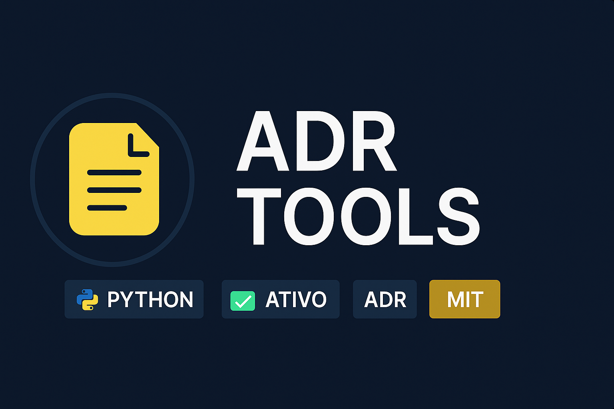

<p align="center">
  
</p>

<h1 align="center">📚 ADR TOOLS</h1>

<p align="center">
  
</p>

<p align="center">
  <a></a>
  <a></a>
</p>

---

# 📝 Sobre o Projeto

O **ADR Tools** é uma aplicação desktop desenvolvida em **Python para facilitar a criação, listagem e gerenciamento de **ADRs (Architecture Decision Records)** — documentos essenciais para registrar decisões arquiteturais em projetos de software.

Com ele, você pode:

- ✔ Criar ADRs automaticamente  
- ✔ Listar decisões existentes  
- ✔ Manter histórico padronizado  
- ✔ Gerar arquivos Markdown  
- ✔ Organizar decisões de Engenharia de Software  

Ferramenta ideal para estudantes e desenvolvedores que buscam documentar decisões técnicas com boas práticas.

---

# 🚀 Como executar o projeto

## 1️⃣ Clone o repositório
```bash
git clone https://github.com/MatheusPereiira/projeto-adr-tools-
cd projeto-adr-tools-
```

---

# 📄 Modelo de ADR (Exemplo)

```md
# ADR 001: Nome da decisão

## Status
Aceito | Proposto | Rejeitado | Depreciado

## Contexto
Descreva o cenário que motivou a decisão.

## Decisão
Explique a decisão tomada e os motivos por trás dela.

## Consequências
Liste impactos positivos e negativos dessa decisão.
```

---

# 📂 Estrutura do Projeto

```bash
projeto-adr-tools-/
│   ├── doc/              # Templates dos ADRs
├── images/
│   ├── banner.png        # Banner do README
│   └── logo.png          # Logo do projeto
├── scr                   # Arquivo principal
└── README.md             # Documentação
```

---

# 📄 Licença
Este projeto está licenciado sob a **MIT License**.  
Você pode usar, modificar e distribuir livremente.

---

# 👤 Autor
**Matheus Pereira**  
🔥 Apaixonado por Python, automação e desenvolvimento desktop.  
📬 GitHub: https://github.com/MatheusPereiira  

---
